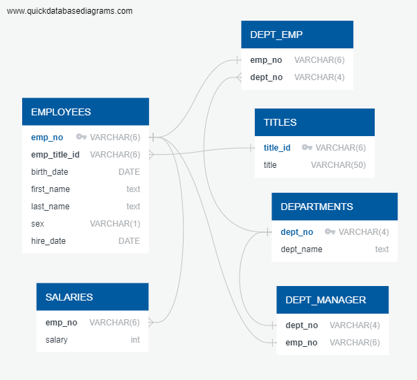

# sql-challenge
Data modeling, engineering, and analysis of an employee database with PostgreSQL. 


### Importing data into pgAdmin
To avoid errors, import the data in the same order as the corresponding tables are ordered (top to bottom) in `EmployeeSQL/schemata.sql`.


### File structure
The structure of the directory before running training or inference should be:
```
sql-challenge
├── EmployeeSQL
│   ├── queries.sql      <- file for queries
│   └── schemata.sql     <- table schemata
├── schemata.png     <- Entity Relationship Diagram of the tables
├── LICENSE          <- MIT
└── README.md        <- this
```



